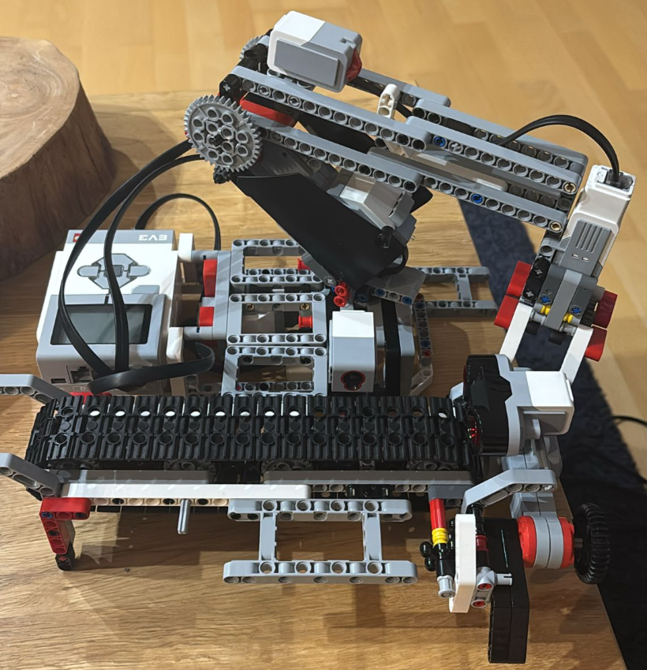

# Kurzbeschreibung Projekt

## Aufbau 

Der Roboter besteht aus folgenden Teilen:
- Ein Förderband, über welches die Boxen eingefahren werden
    - Motor für Antrieb
    - Abstandssensor
    - Farbsensor

- Greifarm zum Verlagern der Boxen  
    - 2 Motoren für 2 Achsen  
    - Motor für Greifer
    - Kontaktsensoren

## Funktion

Es soll anfangs eine Kiste eingefahren werden bis zur Haltestelle. Diese soll gescannt werden und anschließend eingelagert werden. Der Roboter greift die Kiste, bewegt sich zur Zielposition und legt diese ab. Nun kann eine neue Kiste eingefahren werden.
